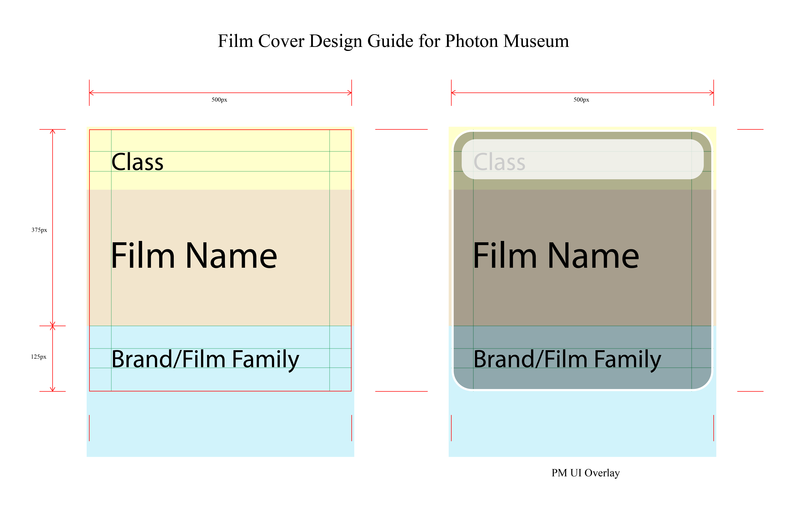

# 🎞 Film Cover/Label Design Guide

This document provides format and design guidelines for creating new **film cover designs** compatible with the *Photon Museum* app. It ensures visual consistency and smooth integration across user-contributed designs.

You are encouraged to download our [template](templates/film_cover_design_template.ai) to start your design.

<p align="center">
  
</p>

---

## 🧱 1. File Format

| Type | Requirement |
|------|--------------|
| **File format** | `.png` or `.jpg` |
| **Aspect ratio** | **1:1 (square)** |
| **Recommended size** | 500 × 500 px |
| **Background** | Solid color or gradient (no transparency required) |
| **Naming convention** | `brand_series_iso.png` or `brand_series_iso_class.png` (recommended if class is specified in design) <br> e.g. `kodak_portra_400.png` or `kodak_portra_400_135.png` |

## 🎨 2. Design Principles

To maintain consistency with the built-in film covers, please follow these general design rules:

1. **Minimal reinterpretation** — inspired by the real packaging, but simplified and unified in style.
2. **Non-commercial intent** — all designs are shared for educational and archival use only.


## 🧾 3. Metadata (optional but encouraged)

You can include a small `.json` file with each cover to describe the film properties:

```json
{
  "brand": "Kodak",
  "family": "Professional",
  "series": "Portra",
  "iso": 400,
  "class": "135",
  "type": "Color Negative",
  "process": "C-41",
  "designer": "Your Name",
  "notes": "Inspired by ..."
}
