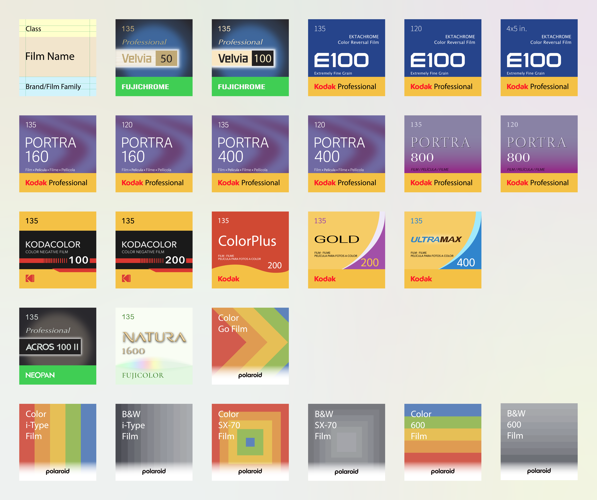
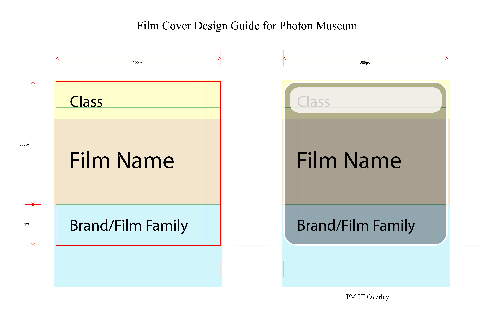

# Film Covers — Inspired Re-creations for Photon Museum

A curated collection of **film cover designs** recreated with a unified visual language for the **Photon Museum** project. These covers are **inspired by** the classic aesthetics of analog film packaging (Kodak, Fujifilm, etc.) and reinterpreted through a minimal, modern lens for digital archiving and app integration.

  

---

## 📦 Overview

This repository serves as an **open visual library** for film enthusiasts, developers, and designers who want to:

- Display consistent film covers in apps or archives  
- Study the evolution of film packaging design  
- Contribute new designs that fit the Photon Museum style system  

All covers here are **original re-creations**, not scans or official reproductions.

---

## 🎞 Included Films

| Brand | Series | ISO | Class | Type
|--------|---------|-----|-----|-----
| Fujifilm | Velvia 50 / 100 | 50 / 100 | 135 | Color Reversal
| Kodak | Ektachrome 100 | 100 | 135 / 120 / 4x5 | Color Reversal
| Kodak | Portra 160 / 400 / 800 | 160 / 400 / 800 | 135 / 120 | Color Negative
| Kodak | Gold / ColorPlus / Ultramax | 200 / 400 | 135 | Color Negative
| Fujifilm | Natura 1600 | 1600 | 135 | Color Negative

*(See the `/official` folder for the full list.)*

---

## 🎨 Design Acknowledgement

All covers (in the `/official` folder) are **original re-creations by Sean Wu**, made for visual consistency within the Photon Museum app.  
They are **inspired by** the design language of classic film brands, but **not direct reproductions**.

All brand names and logos remain the trademarks of their respective owners.  
No affiliation or endorsement is implied.  
These materials are provided **for educational, archival, and non-commercial purposes only**.

If you are a rights holder and wish to request modification or removal of any design, please contact me via GitHub or email.

---

## 🧑‍🎨 Make Your Covers

Please refer to the [Design Guide](DESIGN_GUIDE.md) and download the [Template](templates/film_cover_design_template.ai) to start.

  

---

## 👐 Contribute

If you want to contribute to this repository, please...

---

## 🪪 License

Except for brand names and trademarks belonging to their owners,  
all original designs, layouts, and metadata in this repository are licensed under:

**Creative Commons Attribution – NonCommercial 4.0 International (CC BY-NC 4.0)**  
➡️ [Read the license terms](https://creativecommons.org/licenses/by-nc/4.0/)

